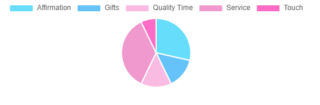

# Practice Repo: Creat a Graph in React
- By using Chart.js I have been able to succesfully generate a chart that can be used to pass data into from state. Currently the data is hardcoded in for this example.
- The generated result from the provided code will look as follows...
